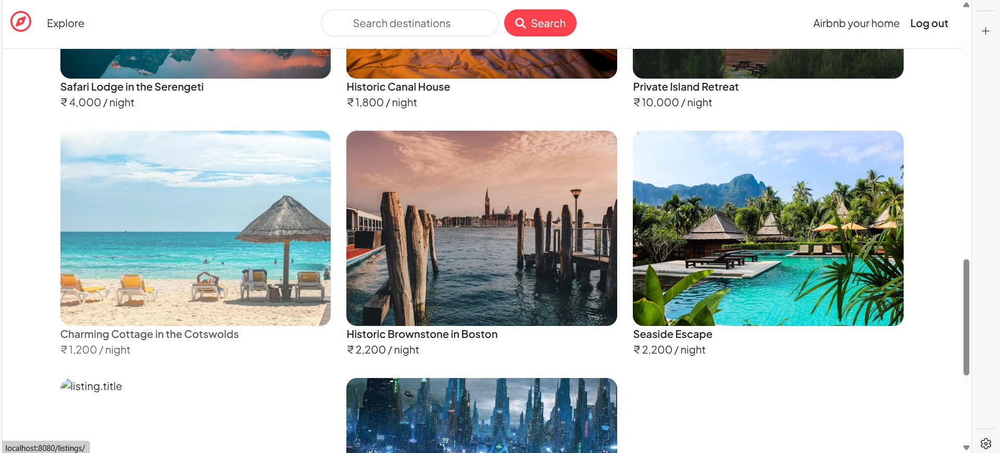

# 🏨 Wanderlust - Hotel Listing Platform

A full-stack hotel listing and review platform inspired by Airbnb, where users can discover, list, and review properties around the world.

## 🔗 Links

- **Live Demo**: [https://wanderlust-n561.onrender.com/listings](https://wanderlust-n561.onrender.com/listings)
- **Repository**: [https://github.com/SujalTripathi/Major-Project](https://github.com/SujalTripathi/Major-Project)

## 📖 Overview

Wanderlust is a comprehensive hotel listing platform that enables property owners to showcase their accommodations and travelers to discover and review places to stay. The platform features user authentication, property listings with images, interactive maps, and a review system.

## ✨ Key Features

- 🏠 **Property Listings**: Browse and search through various accommodations
- 📝 **User Registration**: Sign up and manage your account
- ✍️ **Reviews & Ratings**: Leave reviews and rate properties
- 📍 **Location Maps**: Interactive maps showing property locations
- 🖼️ **Image Gallery**: Multiple images per listing
- 👤 **User Profiles**: Manage your listings and reviews
- 🔍 **Search & Filter**: Find properties based on location and preferences
- 📱 **Responsive Design**: Optimized for all device sizes

## 🛠️ Tech Stack

### Frontend
- **EJS** - Embedded JavaScript templating
- **HTML5** - Markup structure
- **CSS3** - Styling and layouts
- **Bootstrap** - Responsive UI framework
- **JavaScript** - Client-side interactivity

### Backend
- **Node.js** - JavaScript runtime environment
- **Express.js** - Web application framework
- **MongoDB** - NoSQL database for data storage
- **Mongoose** - MongoDB object modeling

### Authentication & Security
- **Passport.js** - Authentication middleware
- **Express Session** - Session management
- **Connect Flash** - Flash messages

### Additional Tools
- **Cloudinary** - Image upload and storage
- **Mapbox** - Interactive mapping service
- **Joi** - Data validation
- **Method Override** - HTTP method support

### Deployment
- **Render** - Cloud platform for hosting
- **MongoDB Atlas** - Cloud database hosting

## 🚀 Getting Started

### Prerequisites
- Node.js (v14 or higher)
- MongoDB (local or Atlas account)
- Cloudinary account (for image uploads)
- Mapbox API key (for maps)

### Installation

1. Clone the repository
```bash
git clone https://github.com/SujalTripathi/Major-Project.git
cd Major-Project
```

2. Install dependencies
```bash
npm install
```

3. Set up environment variables
Create a `.env` file with:
```
MONGODB_URL=your_mongodb_connection_string
CLOUDINARY_CLOUD_NAME=your_cloud_name
CLOUDINARY_API_KEY=your_api_key
CLOUDINARY_API_SECRET=your_api_secret
MAPBOX_TOKEN=your_mapbox_token
SESSION_SECRET=your_secret_key
```

4. Start the server
```bash
npm start
```

5. Visit `http://localhost:3000`

## 📸 Screenshots



## 💡 Project Highlights

- **MVC Architecture**: Clean separation of concerns
- **RESTful API**: Well-structured API endpoints
- **Data Validation**: Server-side validation with Joi
- **Error Handling**: Comprehensive error handling middleware
- **Security**: Protected routes and secure authentication
- **File Upload**: Efficient image handling with Cloudinary

## 🎯 Use Cases

- Property rental platforms
- Hotel booking websites
- Vacation rental marketplaces
- Bed & Breakfast listings
- Hostel booking systems

## 🔮 Future Enhancements

- Payment integration (Stripe/PayPal)
- Booking calendar system
- Real-time availability updates
- Advanced search filters
- Wishlist functionality
- Email notifications
- Multi-language support
- Mobile app version

## 🎓 Learning Outcomes

- Full-stack web development with MERN concepts
- Authentication and authorization
- Database design and relationships
- File upload and cloud storage
- RESTful API design
- Template rendering with EJS
- Session management

## 👨‍💻 Developer

**Sujal Tripathi**
- GitHub: [@SujalTripathi](https://github.com/SujalTripathi)
- LinkedIn: [Sujal Tripathi](https://www.linkedin.com/in/sujaltripathi/)

## 📄 License

This project is open source and available under the MIT License.
